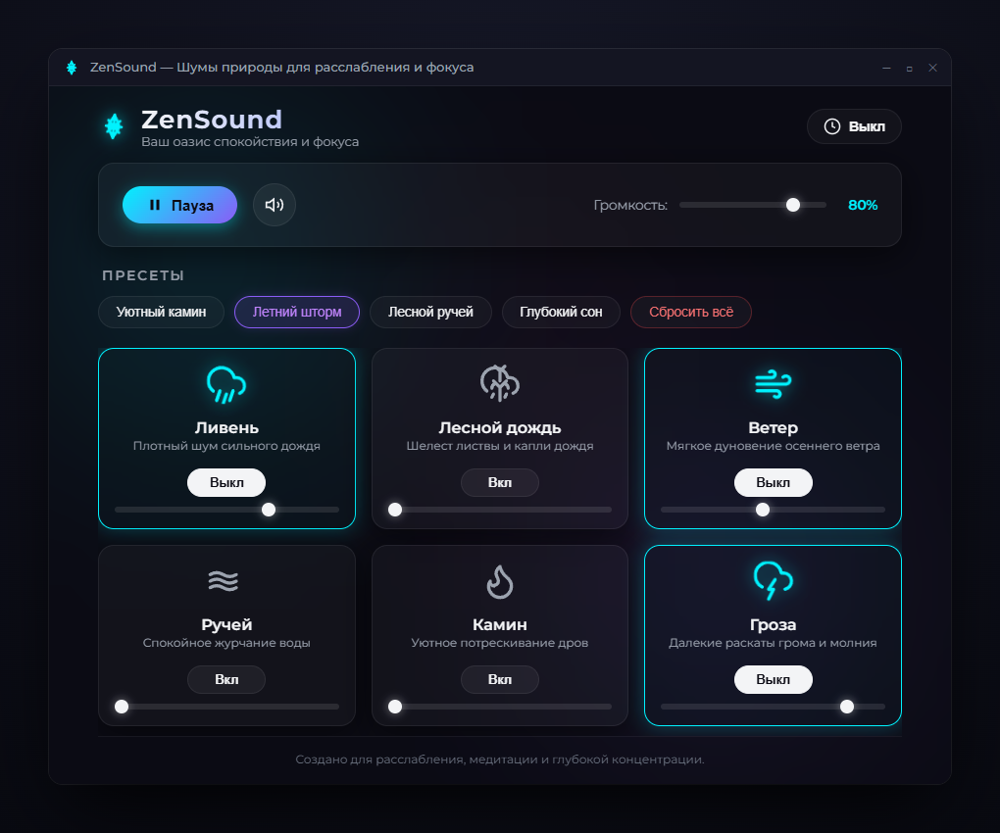
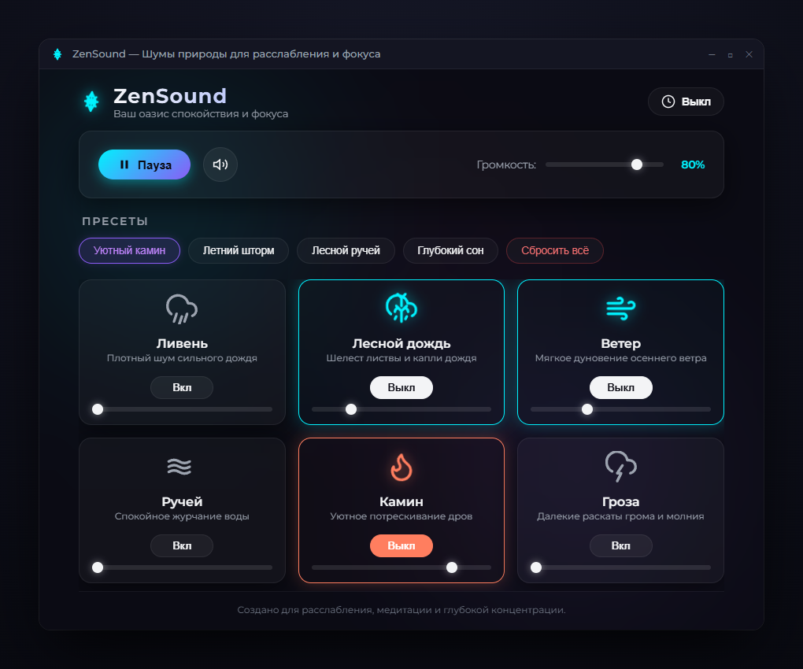
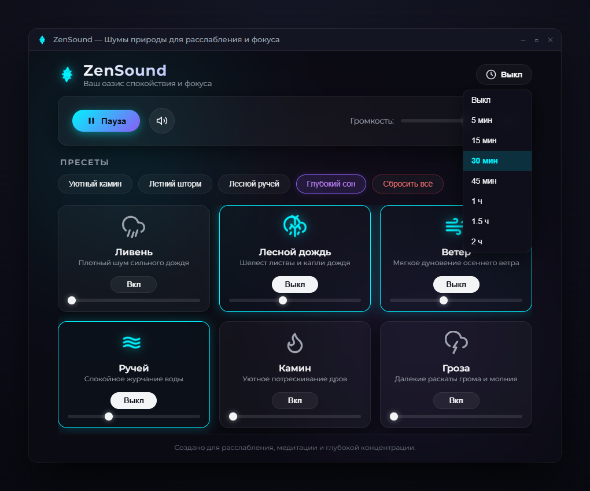
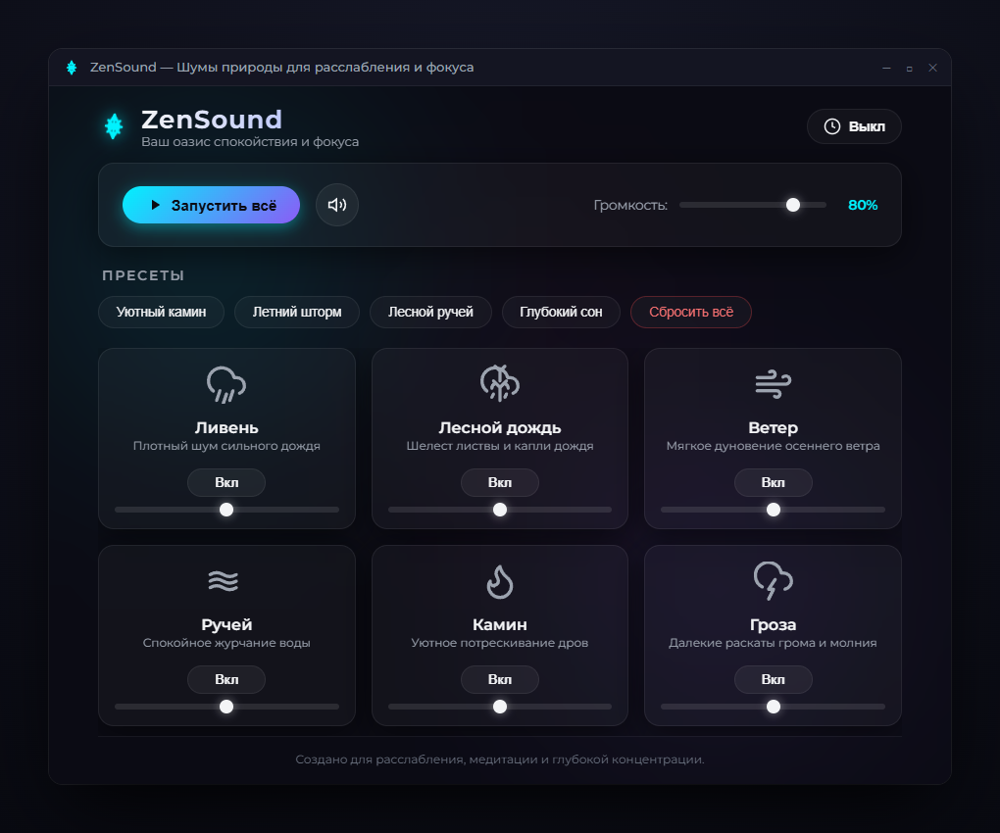

<div align="center">

# 🌿 ZenSound

### Медитативный генератор шумов природы для глубокой концентрации, работы и сна
*Minimalist offline ambient soundscape generator for focus, relaxation & deep sleep*

<br/>

[](https://github.com)
[](https://tauri.app)
[](https://www.rust-lang.org)
[](ZenSound.exe)
[](#-100-автономность--легковесность)
[](LICENSE)

<br/>



<br/>
<br/>

[📥 **Скачать .exe**](#-скачать-готовый-билд) &nbsp;•&nbsp;
[✨ **Возможности**](#-ключевые-особенности) &nbsp;•&nbsp;
[📸 **Скриншоты**](#-галерея-интерфейса) &nbsp;•&nbsp;
[🛠️ **Сборка**](#-сборка-из-исходников) &nbsp;•&nbsp;
[🎵 **Аудио-кредиты**](#-аудиодорожки-и-лицензии)

---

</div>

## 📖 О проекте

**ZenSound** — это компактное, быстрое и полностью автономное приложение для Windows, разработанное на базе современного фреймворка **Tauri v2** и **Rust**. 

Приложение создано для тех, кто ищет спокойную фоновую атмосферу для работы за компьютером, чтения, медитации или быстрого засыпания. В отличие от тяжелых аналогов на Electron или сайтов в браузере с постоянной рекламой, **ZenSound** не требует подключения к интернету, запускается за доли секунды и потребляет всего **~25–35 МБ оперативной памяти**.

<br/>

---

## ✨ Ключевые особенности

### 🎛️ 6 независимых природных аудиоканалов
Создавайте собственные уникальные звуковые ландшафты, комбинируя звуки и регулируя баланс каждого из них:
* 🌧️ **Ливень** — плотный, успокаивающий шум сильного дождя.
* 🍃 **Лесной дождь** — нежные капли, падающие на листву деревьев.
* 💨 **Ветер** — мягкое осеннее дуновение и шелест прохладного ветра.
* 🌊 **Ручей** — непрерывное умиротворяющее журчание лесного ручья.
* 🔥 **Камин** — уютный потрескивающий огонь и тепло горящих поленьев.
* ⚡ **Гроза** — далекие раскаты грома и атмосферная электрическая буря.

Каждый канал имеет собственный выключатель, плавный регулятор громкости (**0–100%**) и бесшовное зацикливание звука (seamless loop) без щелчков и пауз.

---

### 🪄 Готовые атмосферные пресеты
Переключайтесь между настроенными композициями в один клик с плавной 800-мс интерполяцией громкости:
* 🔥 **«Уютный камин»** — тепло домашнего очага, мягкий дождь за окном и тихий шепот ветра.
* ⛈️ **«Летний шторм»** — раскаты грома, грозовой ливень и мощные порывы ветра.
* 🌲 **«Лесной ручей»** — свежесть соснового леса, журчание воды и шелест листвы.
* 🌙 **«Глубокий сон»** — мягкий шум капель, деликатный ветерок и фоновое журчание для быстрого засыпания.
* 🛑 **«Сбросить всё»** — мгновенное выключение всех активных дорожек в одно касание.

---

### ⏱️ Умный таймер сна (Sleep Timer)
* Настраиваемые интервалы: **5 мин**, **15 мин**, **30 мин**, **45 мин**, **1 час**, **1.5 часа**, **2 часа**.
* **Плавное затухание (Smooth Fade-Out)**: в последние 30 секунд до истечения таймера громкость звука плавно снижается до нуля. Вы никогда не проснетесь от резкой внезапной тишины.
* Текущий обратный отсчет отображается прямо на кнопке таймера в реальном времени.

---

### 🌌 Эстетичный Dark Glassmorphism интерфейс
* Глубокая темная тема с анимированным градиентным северным сиянием (**Aurora glow**).
* Индивидуальная неоновая подсветка для активных каналов (голубой неон для воды и шторма, теплый янтарный отблеск для камина).
* Минималистичные векторные иконки с живой анимацией пульсации.
* Никаких раздражающих баннеров, всплывающих окон или лишних настроек.

---

### 🚀 100% автономность & легковесность
* **Полный оффлайн**: все аудиофайлы и шрифты вшиты внутрь приложения. Никаких сетевых запросов, телеметрии или подписок.
* **Портативный `.exe` (17.3 МБ)**: один файл, который можно закинуть на флешку и сразу открыть на любом компьютере с Windows 10/11 без установки сторонних компонентов.
* **Энергоэффективность**: потребляет в разы меньше батареи на ноутбуках по сравнению с вкладками браузера YouTube / Spotify.

<br/>

---

## 📸 Галерея интерфейса

<div align="center">

### Пресет «Уютный камин» (Теплая подсветка и смешанный микс)


<br/>

### Выбор интервала таймера сна


<br/>

### Стартовый экран в режиме покоя


</div>

<br/>

---

## 📥 Скачать готовый билд

Вы можете выбрать удобный для вас вариант запуска:

| Файл | Размер | Тип | Описание | Скачать |
| :--- | :---: | :---: | :--- | :---: |
| **`ZenSound.exe`** | **17.3 МБ** | `Portable` | **Портативная версия**. Не требует установки. Просто скачайте и запустите. Идеально для флешки. | [⬇️ Скачать .exe](ZenSound.exe) |
| **`ZenSound_Setup.exe`** | **15.6 МБ** | `NSIS Setup` | **Классический установщик**. Создает ярлыки на рабочем столе и в меню «Пуск», добавляет пункт в «Установку и удаление программ». | [⬇️ Скачать установщик](ZenSound_Setup.exe) |

> [!NOTE]
> Приложение совместимо с **Windows 10** и **Windows 11** (x64). Для работы не требуются дополнительные пакеты или runtime-библиотеки.

<br/>

---

## 🛠️ Стек технологий и архитектура

ZenSound построен по принципу максимальной производительности и надежности:

```
noise-generator/
├── src-tauri/               # Rust бэкенд на базе Tauri v2
│   ├── Cargo.toml           # Зависимости Rust и настройки компиляции
│   ├── tauri.conf.json      # Конфигурация окна, иконок и бандлера
│   └── src/main.rs          # Точка входа Tauri-приложения
├── src/                     # Высокоскоростной легковесный фронтенд
│   ├── index.html           # Разметка интерфейса и SVG-иконки
│   ├── styles.css           # Glassmorphism, Aurora-эффекты и адаптивная сетка
│   ├── main.js              # Аудио-движок, микшер каналов, пресеты и таймер сна
│   └── assets/sounds/       # Оптимизированные бесшовные OGG-аудиодорожки
├── screenshots/             # Скриншоты и баннеры для репозитория
├── ZenSound.exe             # Автономный портативный исполняемый файл
└── ZenSound_Setup.exe       # Установочный пакет NSIS
```

* **Desktop Runtime:** [Tauri v2](https://tauri.app/) (Rust) — обеспечивает нативную интеграцию с ОС с минимальным потреблением ОЗУ.
* **Frontend:** Чистый HTML5, CSS3 Glassmorphism и Vanilla ES6+ JavaScript — максимальная отзывчивость без оверхэда фреймворков.
* **Audio Engine:** HTML5 Web Audio API & Audio Loops с адаптивной компенсацией задержек и плавной интерполяцией кривых громкости.
* **Audio Format:** OGG Vorbis, сжатый с оптимизацией для непрерывного бесшовного цикла (seamless loops).

<br/>

---

## ⚙️ Сборка из исходников

Если вы хотите собрать проект самостоятельно:

### Требования:
1. **Node.js** (версия 18 или новее)
2. **Rust & Cargo** (установите через [rustup.rs](https://rustup.rs/))
3. **C++ Build Tools** (часть Visual Studio Community или Visual Studio Build Tools с пакетом «Desktop development with C++»)

### Шаги сборки:

```bash
# 1. Клонируйте репозиторий
git clone https://github.com/your-username/noise-generator.git
cd noise-generator

# 2. Установите npm-зависимости (Tauri CLI)
npm install

# 3. Запуск приложения в режиме разработки (с Live Reload)
npm run tauri dev

# 4. Сборка оптимизированного релизного .exe и установщика
npm run tauri build
```

Готовые исполняемые файлы будут сгенерированы по путям:
* **Портативный бинарник:** `src-tauri/target/release/ZenSound.exe`
* **NSIS Установщик:** `src-tauri/target/release/bundle/nsis/ZenSound_1.0.0_x64-setup.exe`

<br/>

---

## 🎵 Аудиодорожки и лицензии

Все звуки, используемые в ZenSound, распространяются под свободными лицензиями для коммерческого и некоммерческого использования:

| Звук | Описание | Лицензия | Источник |
| :--- | :--- | :---: | :--- |
| **Ливень** (`heavy-rain.ogg`) | Плотный непрерывный ливень | [CC0 1.0 Public Domain](https://creativecommons.org/publicdomain/zero/1.0/) | [Freesound](https://freesound.org) |
| **Лесной дождь** (`forest-rain.ogg`) | Капли дождя на листьях в лесу | [CC BY 3.0](https://creativecommons.org/licenses/by/3.0/) | [Freesound](https://freesound.org) |
| **Ветер** (`wind.ogg`) | Мягкий непрерывный осенний ветер | [CC0 1.0 Public Domain](https://creativecommons.org/publicdomain/zero/1.0/) | [Freesound](https://freesound.org) |
| **Ручей** (`stream.ogg`) | Спокойный лесной ручей с чистой водой | [CC0 1.0 Public Domain](https://creativecommons.org/publicdomain/zero/1.0/) | [Freesound](https://freesound.org) |
| **Камин** (`fireplace.ogg`) | Уютный потрескивающий огонь в камине | [CC0 1.0 Public Domain](https://creativecommons.org/publicdomain/zero/1.0/) | [Freesound](https://freesound.org) |
| **Гроза** (`thunderstorm.ogg`) | Раскаты грома и молнии на фоне бури | [CC0 1.0 Public Domain](https://creativecommons.org/publicdomain/zero/1.0/) | [Freesound](https://freesound.org) |

---

## 📄 Лицензия

Проект распространяется под свободной лицензией **MIT License**. Подробнее см. в файле [LICENSE](LICENSE).

<br/>

<div align="center">
  <sub>Создано с заботой о спокойствии и фокусе 🌿</sub>
</div>
